# omnon ビルドガイド

---

**omnon** をご購入頂きありがとうございます。  
こちらは **omnon** ビルドガイドになります。

## 目次

---

- [omnon ビルドガイド](#omnon-ビルドガイド)
  - [目次](#目次)
  - [キット内容と必要な物の確認](#キット内容と必要な物の確認)
  - [組み立て](#組み立て)
    - [部品の準備](#部品の準備)
    - [はんだ付け](#はんだ付け)
    - [本体の組み立て](#本体の組み立て)
  - [使い方](#使い方)
    - [ファームウェアの書き換え](#ファームウェアの書き換え)
  - [注意点・免責](#注意点免責)
  - [その他](#その他)
    - [塗装](#塗装)
  - [さいごに](#さいごに)
  - [トラブルシューティング](#トラブルシューティング)
    - [タクタイルスイッチ組み付け後にクリック感がない場合](#タクタイルスイッチ組み付け後にクリック感がない場合)

## キット内容と必要な物の確認

---

まずはキット内容をご確認ください。
商品に不足や不具合がある場合は、お手数ですが booth からご連絡ください。

**omnon キット内容**

| 部品名                        | 数量   | 備考                    |
| ----------------------------- | ------ | ----------------------- |
| メイン基板                    | 1 個   |
| ジョイスティック&スイッチ基板 | 1 個   |
| ジョイスティック              | 2 個   |
| メインケース                  | 1 個   |
| ボトムケース                  | 1 個   |
| トラックボールケース          | 1 個   |
| マウスプレート                | 1 個   |
| スイッチカバー                | 2 個   |
| スイッチカバー押え            | 1 個   |
| トラックボール                | 2 個   | φ20                     |
| トラックボール支持球          | 6 個   | φ2                      |
| ねじ(黒)                      | 11 個  | P タイト M2-L5          |
| ねじ(白)                      | 11 個  | P タイト M2-L5          |
| 可変抵抗(ジョイスティック)    | 2 個   | RKJXV122400R            |
| タクタイルスイッチ            | 2 個   | DTS-63-N-V-BLK          |
| 配線 0.12sq(AWG26)            | 640 mm | (52mmx10 本、40mmx3 本) |
| クッションゴム                | 4 個   |

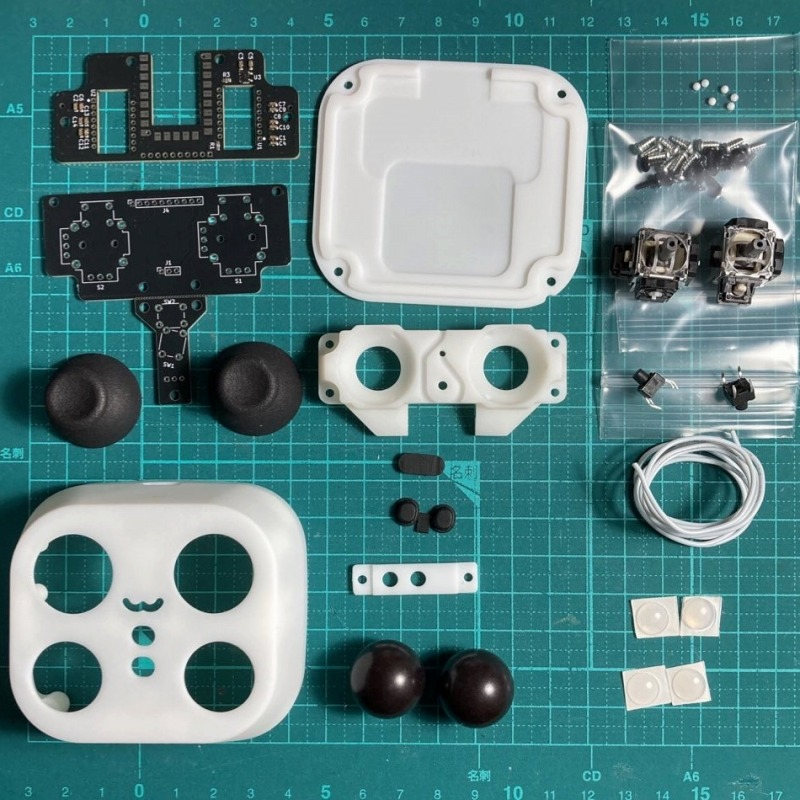

※左上からリストの順番に並んでいます。

**別途購入が必要な物**

| 部品名                | 数量      | 備考                                                                        |
| --------------------- | --------- | --------------------------------------------------------------------------- |
| RP2040-Zero (必須)    | 1 個      |                                                                             |
| マウスセンサー (任意) | 1 or 2 個 | トラックボールを使用する場合、PMW3360DM-T2QU と LM19-LSI をご用意ください。 |

  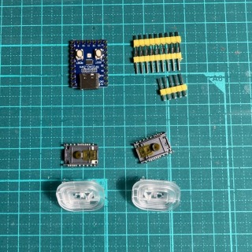
  
**工具、その他**

- はんだ
- はんだごて
- マスキングテープ
- カッター
- ニッパー
- ワイヤーストリッパー
- 接着剤(エポキシ 2 液混合タイプ)
- プラスドライバー(#1)

**ファームウェア**

- build 済みのものは [こちら](https://)。
- ソースコードは[こちら](https://)。
  (QMK firmware ver0.23.8 にてコンパイルしています。)

 

    ファームウェアの書き込み
    ※最初にRP2040-Zeroに不具合がないか、
      ファームウェアが正常に書き込めるか確認する事を推奨します。
    1. RP2040-ZEROのbootボタンを押しながらUSBに差し込みます。
    2. エクスプローラーが立ち上がるので、
       build済みのファームウェア(omnon.uf2)をドラッグアンドドロップします。
    3. ピンセット等でGPIO10番とGNDを接触させ、右クリックされることを確認します。

## 組み立て

### 部品の準備

---

**1. 配線の準備**

    1. 配線を52mm10本、40mm3本となるように切断します。
    2. 被覆の先端を2mm程度剥いておきます。
    3. 52mmの配線の形を整えます。(必須ではありません。)
    4. 整える際は、トラックボールケースの穴に配線を入れ、溝に沿わせていきケースの端で折り曲げてください。
      ※赤矢印の箇所で配線がケースのツラくらいになるのが正しい位置です。

  

    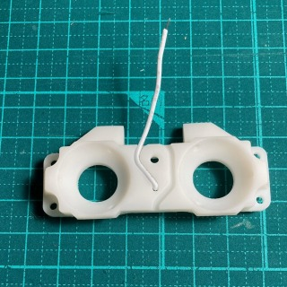
    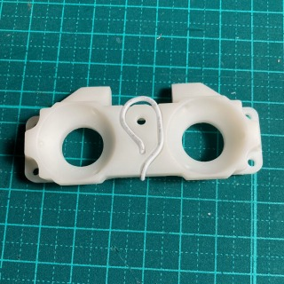
    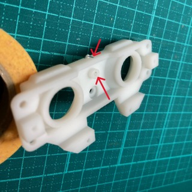
  

**2. トラックボールケースの準備**
　※ 接着剤はエポキシ 2 液混合タイプを推奨します。

    1.  接着剤を混合し、爪楊枝先端に着けトラックボールケースのくぼみ6箇所に塗ります。
    2.  支持球を入れて指の腹で軽く押さえ接着剤が固まるまで置いておきます。

  

    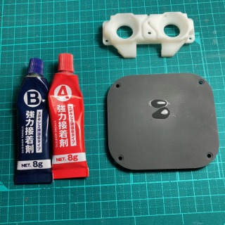
    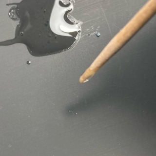
    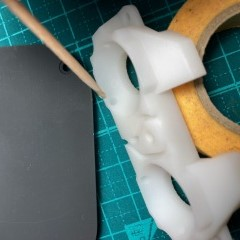
  

  

    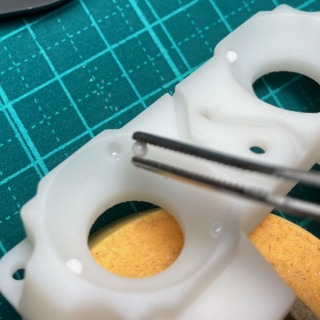
    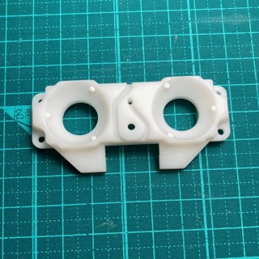
  

**3. ジョイスティック基板とスイッチ基板の切断**

    1.  小さな穴に沿って、裏表にカッターで切れ目を入れます。
    2.  切れ目を入れた個所を机の角などに合わせ基板を折ります。

  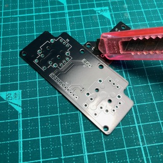
  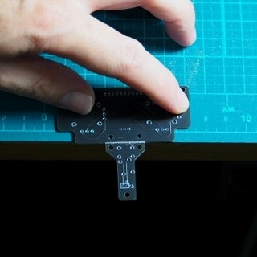

**4. ボタンを切り離します**

    1. ボタンを赤線位置でカッターで切れ目を入れ切断します。

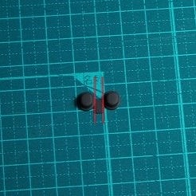

### はんだ付け

---

各部品をそれぞれはんだ付けしていきます。

**1. スイッチ基板**

     1. タクタイルスイッチを基板にはめ裏側からはんだ付けします。

  

    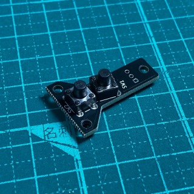
    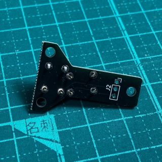
  

  
**2. ジョイスティック基板**

     1. 可変抵抗を基板にのせ、マスキングテープで固定し裏側からはんだ付けします。
     2. マスキングテープが邪魔になる場合、最初に数箇所はんだ付けし仮固定後はを外して残りをはんだ付けしてください。
       ※基板から浮いてしまうとケースと干渉する可能性があります。
       　浮かないように注意してください。

  

    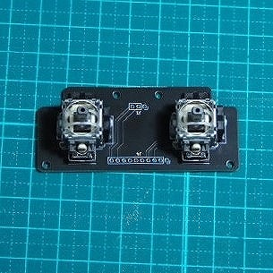
    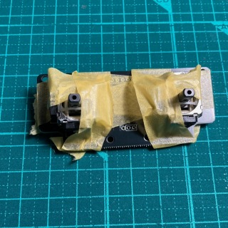
    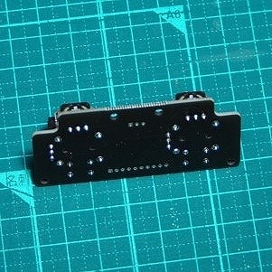
  

  
**3. メイン基板**
基板に rp2040-zero を取り付けます。
※写真を参考に向きを間違えないよう注意してください。

    1.  rp2040-zero付属のピンヘッダを1pin分に切断してください。
    2.  基板の2箇所の穴とrp2040-zeroに切断したピンを刺します。
        ※ピンは基板に対し少しきつめになっています。
        入れにくい場合は、ハンマー等硬いもので軽くたたいてください。

  

    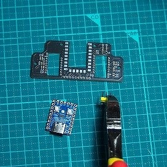
    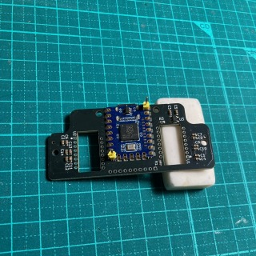
  

  
    3.  ピンを指していない箇所をはんだ付けします。
    4.  まずは一点目にをはんだを付けます。その後、浮かないように指で押さえながら再度はんだを溶かします。
    5.  次に対角に位置する箇所も同じようにはんだを付けます。
    6.  ピンを抜き全てはんだ付けします。
  
  

    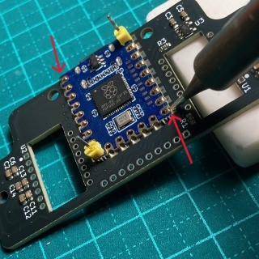
    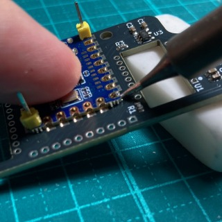
  

  

    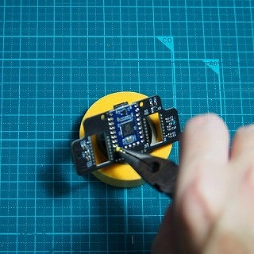
    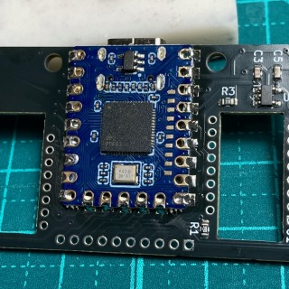
  

  
**4. PMW3360 (オプション)**
基板に PMW3360 を取り付けます。
PMW3360は最初からつける場合は、このタイミングが作業しやすいですが、全て配線が終わった後でも追加出来ます。

     1. センサを基板に挿入し、マスキングテープで固定します。
        ※センサーには向きがあります。マーク位置を合わせてください。
     2. 表側を向け、センサのはんだ付けをします。※2枚目の写真は後から追加した場合の写真です。
     3. センサについている保護フィルムをはずし、レンズを取り付けます。
        ※レンズにも向きがあります。分かりにくいですが、LEDの光が出る側にレンズの三角形の凸がきます。

  

    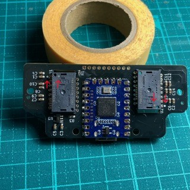
    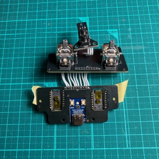
    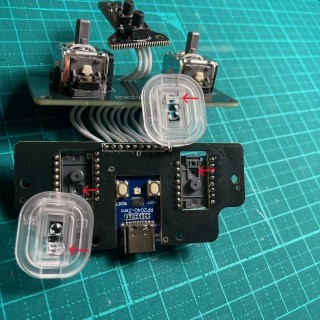
  

  
**5. 配線**

    1. ジョイスティック基板とスイッチ基板を配線します。
      1. ジョイスティック基板の表側から線を入れ、裏側からはんだ付けします。
         ※ マスキングテープで配線を仮止めすると、まとめてはんだ付けでき作業がしやすいです。

      2. スイッチ基板裏側から線を入れ、表側からはんだ付けします。
        ※配線が交差しないよう注意してください。
        　スルーホール端の1か所が□になっています。
        　□同士が接続される状態がただしいです。

  

    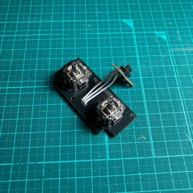
    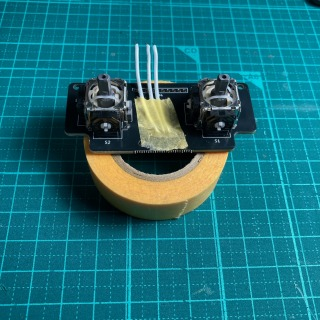
  

  

    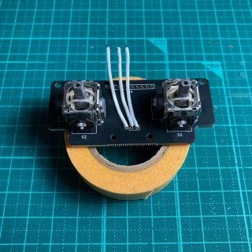
    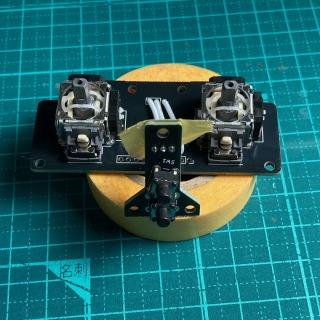
  

  
 

    2. ジョイスティック基板とメイン基板を配線します。
      1. ジョイスティック基板裏側から配線をいれ、表側からはんだ付けします。
      2. メイン基板裏側から配線を入れ、表側からはんだ付けします。
        ※配線が交差しないよう注意してください。
        　スルーホール端の1か所が□になっています。
        　□同士が接続される状態がただしいです。

  

    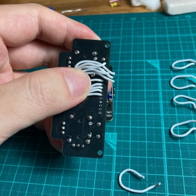
    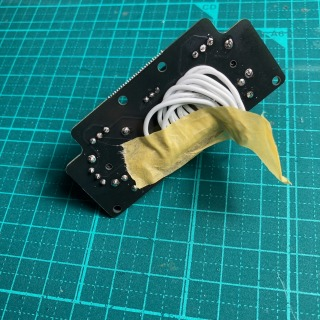
    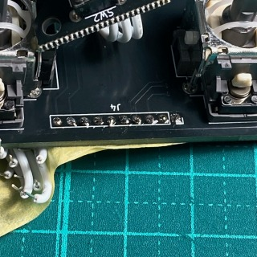
  

  

    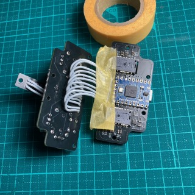
    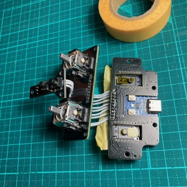    
  

  
### 本体の組み立て

---

はんだ付けした部品をケースに組付けていきます。
ケースの取り付けには黒色のねじを、基板の取り付けにはシルバーのねじを使用してください。

**1. スイッチ基板の取付**

    1. メインケースにマウスプレート、スイッチカバーを入れます。
    2. スイッチ押えを上から載せねじで固定します。(向きに注意してください。)

  

    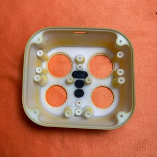
    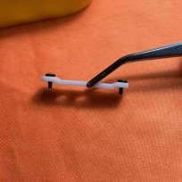
    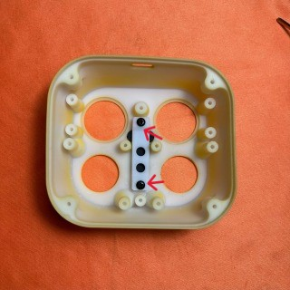
  

    
    3. スイッチ基板を載せねじで固定します。
    4. スイッチが押せるか確認してください。(カチカチとクリック感があります。)

※クリック感がない場合は、メインケースのサポート材が除去しきれていない可能性があります。
　[こちら](#タクタイルスイッチ組み付け後にクリック感がない場合)をご確認ください。
　それでも解決しない場合はお手数ですが、販売ページよりご連絡ください。

  

    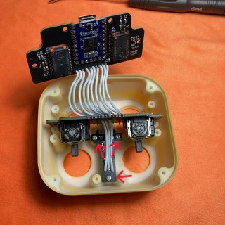
    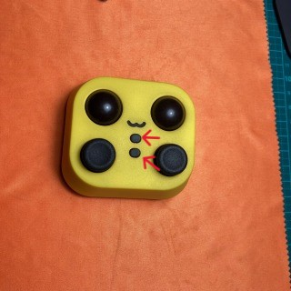
  

  
**2. ジョイスティック基板の取付**

    1. ジョイスティックを可変抵抗に差し込みます。
       ※可変抵抗とジョイスティック切り欠きの向きは下図のようにしてください。
    2. ジョイスティック基板をメインケースに取り付けます。

  

    
    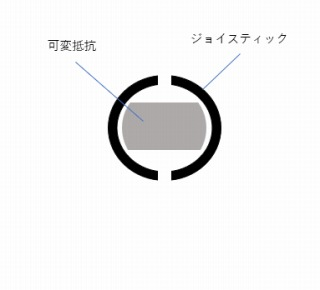
    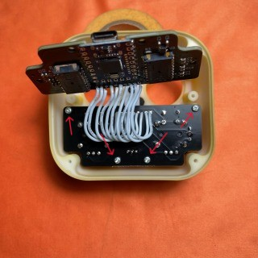
  

  
**3. トラックボールケースの取付**
　※支持球の接着剤が乾いてから作業をしてください。

     1. トラックボールをメインケースに置きます。
     2. トラックボールケースを上から載せねじで固定します。
      ※ トラックボールがスムーズに動くことを確認してください。
     　　どこかが当たる場合は、ねじをゆるめケース位置を調整します。

  

    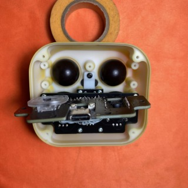
    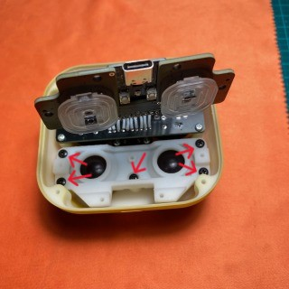
  

    
  **4. メイン基板の取付**
  
    1. メイン基板をトラックボールケースに取り付けます。
       ※USBの位置が中心に来るよう、基板の位置を調整して締め付けてください。
  
  

    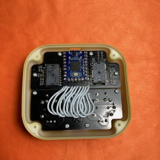
    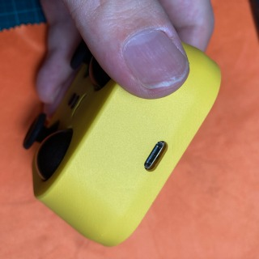
  

    
  **5. ボトムケースの取付**

    1. 切り込みの位置に合わせ、ボトムケースを取り付けます。
    2. 必要な場合は付属のゴム足を貼り付けてください。

  

    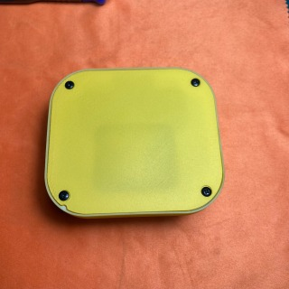
    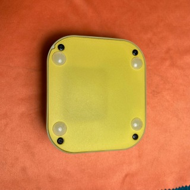
  

  
## 使い方

---

### ファームウェアの書き換え

- 下図赤丸のボタンを押しながら USB を指すことで初期化されるので、uf2 ファイルを書き込んでください。手順は[こちら](#ファームウェア)
  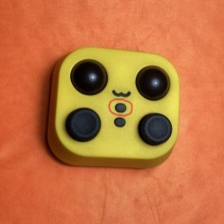

## 注意点・免責

本ビルドガイドおよび製品仕様は、予告なく変更される可能性があります。  
変更が生じた場合、最新の情報は omnon の github をご確認ください。

## その他

### 塗装

メインケース、ボトムケースを塗装することでお好みのカラーにすることができます。
簡単にですが、画像の物を塗装した時の手順をまとめておきます。

1. 中性洗剤を使い水洗いをして、表面の汚れや油分を除去し乾かします。
2. 表側にスプレータイプの塗料で数回に分けて塗装と乾燥を繰り返します。
3. トップコートを数回に分けて塗装します。  
   ※ スプレータイプの塗料やトップコートを使用する場合、ムラになる恐れがあるので一度に塗り過ぎないように注意してください。
   　 塗装前にやすり掛けをすることで、表面が更にきれいになります。
   　 ビルドガイドに掲載している、紫と黄色はガンダムカラースプレー(SG08/SG03)の後、つや消しのトップコートを使用しています。

## さいごに

**omnon** をご購入いただきありがとうございました。  
気になる点など何かありましたら、X(旧 Twitter)にご連絡貰えればと思います。  
また、完成した物を SNS に#omnon や私(@mass_0X00)にメンションをつけて上げて頂けると嬉しいです。

## トラブルシューティング

### タクタイルスイッチ組み付け後にクリック感がない場合

タクタイルスイッチの押し込み部に調整が必要な場合があります。

1.組み付け後にスイッチが押されっぱなしになる場合。

- メインケースのサポート材除去が足りていない場合、スイッチが常に少し押された状態になる可能性があります。
  軽くこすって粉が出る場合は、サポート材が除去しきれていない可能性があります。
  メインケース裏側のスイッチ周辺を、マイナスドライバー等で軽くこすってください。
- 上記が問題ない場合、スイッチ基板を少し下げる必要があります。
  写真のようにマスキングテープを数枚重ねて貼り、穴をあけて組み付けます。

  

    
    
    
  

それでも解消しない場合は交換対応となりますので、お手数ですが詳細をご連絡ください。
