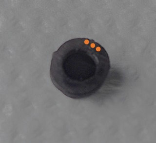
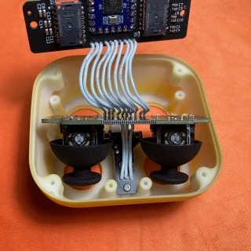
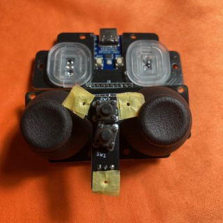
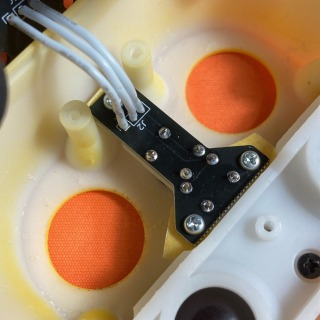

# omnon ビルドガイド

---

**omnon** をご購入頂きありがとうございます。  
こちらは **omnon** ビルドガイドになります。

## 目次

---

- [omnon ビルドガイド](#omnon-ビルドガイド)
  - [目次](#目次)
  - [キット内容と必要な物の確認](#キット内容と必要な物の確認)
        - [ファームウェア](#ファームウェア)
  - [組み立て](#組み立て)
    - [部品の準備](#部品の準備)
    - [はんだ付け](#はんだ付け)
    - [接続の確認](#接続の確認)
    - [本体の組み立て](#本体の組み立て)
  - [使い方](#使い方)
    - [ファームウェアの書き換え](#ファームウェアの書き換え)
  - [注意点・免責](#注意点免責)
  - [その他](#その他)
    - [塗装](#塗装)
  - [さいごに](#さいごに)
  - [トラブルシューティング](#トラブルシューティング)
    - [タクタイルスイッチ組み付け後にクリック感がない](#タクタイルスイッチ組み付け後にクリック感がない)
    - [ジョイスティックが引っ掛かる](#ジョイスティックが引っ掛かる)
    - [その他不具合やトラブルシューティングの内容を実施しても修正できない場合](#その他不具合やトラブルシューティングの内容を実施しても修正できない場合)

## キット内容と必要な物の確認

---

まずはキット内容をご確認ください。
商品に不足や不具合がある場合は、お手数ですが booth からご連絡ください。

**omnon キット内容**

| 部品名                        | 数量   | 備考                    |
| ----------------------------- | ------ | ----------------------- |
| メイン基板                    | 1 個   |
| ジョイスティック&スイッチ基板 | 1 個   |
| ジョイスティック              | 2 個   |
| メインケース                  | 1 個   |
| ボトムケース                  | 1 個   |
| トラックボールケース          | 1 個   |
| マウスプレート                | 1 個   |
| スイッチカバー                | 2 個   |
| スイッチカバー押え            | 1 個   |
| トラックボール                | 2 個   | φ20                     |
| トラックボール支持球          | 6 個   | φ2                      |
| ねじ(黒)                      | 11 個  | P タイト M2-L5          |
| ねじ(白)                      | 11 個  | P タイト M2-L5          |
| 可変抵抗(ジョイスティック)    | 2 個   | RKJXV122400R            |
| タクタイルスイッチ            | 2 個   | DTS-63-N-V-BLK          |
| 配線             | 一式 | (60mmx10 本、40mmx3 本) |
| クッションゴム                | 4 個   |

※左上からリストの順番に並んでいます。

**別途購入が必要な物**

| 部品名                | 数量      | 備考                                                                        |
| --------------------- | --------- | --------------------------------------------------------------------------- |
| RP2040-Zero (必須)    | 1 個      |                                                                             |
| マウスセンサー (任意) | 1 or 2 個 | トラックボールを使用する場合、PMW3360DM-T2QU と LM19-LSI をご用意ください。 |

  
  
**工具、その他**

- はんだ
- はんだごて
- マスキングテープ
- カッター
- ニッパー
- ワイヤーストリッパー
- 接着剤(エポキシ 2 液混合タイプ)
- プラスドライバー(#1)

##### ファームウェア

- build 済みのものは [こちら](https://github.com/mass-work/omnon/tree/main/build)。
- ソースコードは開発中のため公開までしばしお待ちください。

 

    ファームウェアの書き込み
    ※最初にRP2040-Zeroに不具合がないか、
      ファームウェアが正常に書き込めるか確認します。
    1. RP2040-ZEROのbootボタンを押しながらUSBに差し込みます。
    2. エクスプローラーが立ち上がるので、
       build済みのファームウェアをドラッグアンドドロップします。
       (マウスセンサーの取り付けに応じ、dual、left、rightのどれかを書き込んでください。)
    3. ピンセット等でGPIO10番とGNDを接触させ、右クリックされることを確認します。

## 組み立て

### 部品の準備

---

**1. トラックボールケースの準備**
　※ 接着剤はエポキシ 2 液混合タイプを推奨します。
    　　 接着済みの場合があります。その際はこの作業は不要です。

    1.  接着剤を混合し、爪楊枝先端に着けトラックボールケースのくぼみ6箇所に塗ります。
    2.  支持球を入れて指の腹で軽く押さえ接着剤が固まるまで置いておきます。

  

    
    
    
  

  

    
    
  

**2. ジョイスティック基板とスイッチ基板の切断**

    1.  小さな穴に沿って、裏表にカッターで切れ目を入れます。
    2.  切れ目を入れた個所を机の角などに合わせ基板を折ります。

  
  

**3. スイッチを切り離します**

    1. スイッチカバーを赤線位置でカッターで切れ目を入れ切断します。
    ※ スイッチカバーは初めから分かれている場合があります。
    　 スイッチカバーは3種類あります。詳細は組立手順で説明します。

### はんだ付け

---

各部品をそれぞれはんだ付けしていきます。

**1. スイッチ基板**

     1. タクタイルスイッチを基板に取り付け、裏側からはんだ付けします。
   ※取り付け向きに注意してください。
   　二つとも取り付けた後にはんだ付けを行ってください。

  

    
    
  

  
**2. ジョイスティック基板**

> [!CAUTION]
> 基板から浮いてしまうとケースと干渉する可能性があります。
> 浮かないように注意してください。

     1. 可変抵抗を基板にのせ、マスキングテープで固定し裏側からはんだ付けします。
     2. まず最初に一箇所はんだ付けをします。
     3. 基板から浮いていないことを確認してください。
        もし浮いている場合、基板と可変抵抗を押えながらはんだ付けした所をこてで温め直し、
        密着させてください。
        ※押える際に可変抵抗の筺体が熱くなる場合があるので気を付けて作業をしてください。
     4. 2箇所目も同様にはんだ付けをしてください。
     5. 残りの箇所をはんだ付けします。マスキングテープが邪魔になる場合、最初に数箇所はんだ付けし仮固定後はを外して残りをはんだ付けしてください。

  

    
    
    
  

  
**3. メイン基板**
基板に rp2040-zero を取り付けます。
※写真を参考に向きを間違えないよう注意してください。

    1.  rp2040-zero付属のピンヘッダを1pin分に切断してください。
    2.  基板の2箇所の穴とrp2040-zeroに切断したピンを刺します。
        ※ピンは基板に対し少しきつめになっています。
        入れにくい場合は、ハンマー等硬いもので軽くたたいてください。

  

    
    
  

  
    3.  ピンを指していない箇所をはんだ付けします。
    4.  まずは一点目にをはんだを付けます。その後、浮かないように指で押さえながら再度はんだを溶かします。
    5.  次に対角に位置する箇所も同じようにはんだを付けます。
    6.  ピンを抜き全てはんだ付けします。
  
  

    
    
  

  

    
    
  

  
**4. PMW3360 (オプション)**
基板に PMW3360 を取り付けます。
PMW3360は最初からつける場合は、このタイミングが作業しやすいですが、全て配線が終わった後でも追加出来ます。

     1. センサを基板に挿入し、マスキングテープで固定します。
        ※センサーには向きがあります。マーク位置を合わせてください。
     2. 表側を向け、センサのはんだ付けをします。※2枚目の写真は後から追加した場合の写真です。
     3. センサについている保護フィルムをはずし、レンズを取り付けます。
        ※レンズにも向きがあります。分かりにくいですが、LEDの光が出る側にレンズの三角形の凸がきます。

  

    
    
    
  

  
**5. 配線**  
※1 配線は60mm10本、40mm3本にカットして使用してください。   
※2 基板に配線する前に先端を剥いた後、予備はんだする事を推奨します。  
※3 解説では配線をまとめてはんだ付けしています。難しい場合は、少し時間がかかりますが、1本ずつはんだ付けしてください。  

    1. ジョイスティック基板とスイッチ基板を配線(40mm)します。
      1. ジョイスティック基板の表側から線を入れ、裏側からはんだ付けします。
         ※ マスキングテープで配線を仮止めすると、まとめてはんだ付けでき作業がしやすいです。

      2. スイッチ基板裏側から線を入れ、表側からはんだ付けします。
        ※配線が交差しないよう注意してください。
        　スルーホール端の1か所が□になっています。
        　□同士が接続される状態がただしいです。

  

    
    
  

  

    
    
  

  
 

    2. ジョイスティック基板とメイン基板を配線(60mm)します。
      1. ジョイスティック基板裏側から配線をいれ、表側からはんだ付けします。
      2. メイン基板裏側から配線を入れ、表側からはんだ付けします。
        ※配線が交差しないよう注意してください。
        　スルーホール端の1か所が□になっています。
        　□同士が接続される状態がただしいです。

  

    
    
    
  

  

    
        
  

  
  
### 接続の確認
---
ファームウェアを書き込んでいない場合は[こちら](#ファームウェア)を参考に書き込んでください。  
各ボタンやジョイスティック、マウスセンサーが動作するか確認します。  
マウスセンサーはレンズ側から指でなぞることで、設定に応じた動作をします。  
- 初期設定は下記になっています。
  - 左トラックボール：カーソル
  - 右トラックボール：スクロール
  - 左ジョイスティック：カーソル
  - 右ジョイスティック：矢印

> [!CAUTION]
> 本体の組み立て前に必ずファームウェアを書き込んでください。
> 組み込み後はbootボタンが押せないため、omnon本体のボタンを使いブートする設定がファームウェアに書き込まれています。
  
### 本体の組み立て

---

はんだ付けした部品をケースに組付けていきます。
ケースの取り付けには黒色のねじを、基板の取り付けにはシルバーのねじを使用してください。

**1. スイッチ基板の取付**

    1. メインケースにマウスプレート、スイッチカバーを入れます。
    2. スイッチ押えを上から載せねじで固定します。(向きに注意してください。)
   　　

  

    
    
    
  

    
    1. スイッチ基板を載せねじで固定します。
    2. スイッチが押せるか確認してください。(カチカチとクリック感があります。)
    ※スイッチカバーは3種類あります。最初にマーキング(写真3枚目の橙部に凹みがあります)が一つの物を使用し組立、
    　スイッチのクリック感がない場合は、マーキングが二つ、それでも足りない場合は三つの物に変更してく下さい。
    　変更しても解決しない場合はお手数ですが、販売ページよりご連絡ください。

  

    
    
    
  

  
**2. ジョイスティック基板の取付**

    1. ジョイスティックを可変抵抗に差し込みます。
       ※可変抵抗とジョイスティック切り欠きの向きは下図のようにしてください。
    2. ジョイスティック基板をメインケースに取り付けます。

  

    
    
    
  

  
**3. トラックボールケースの取付**
　※支持球の接着剤が乾いてから作業をしてください。

     1. トラックボールをメインケースに置きます。
     2. トラックボールケースを上から載せねじで固定します。
      ※ トラックボールがスムーズに動くことを確認してください。
     　　どこかが当たる場合は、ねじをゆるめケース位置を調整します。

  

    
    
  

    
  **4. メイン基板の取付**
  
    1. メイン基板をトラックボールケースに取り付けます。
       ※USBの位置が中心に来るよう、基板の位置を調整して締め付けてください。
  
  

    
    
  

    
  **5. ボトムケースの取付**

    1. 切り込みの位置に合わせ、ボトムケースを取り付けます。
    2. 必要な場合は付属のゴム足を貼り付けてください。

  

    
    
  

  
  **6. トラックボールの慣らし**
  
    1. 組み付け直後はトラックボールの動きが重たいです。
       軽く指や手のひらで押さえながら1～2分程度上下左右に動かしてください。

  
## 使い方

---

### ファームウェアの書き換え

- 下図赤丸のボタンを押しながら USB を指すことで初期化されるので、uf2ファイルを書き込んでください。  
  build 済みのものは [こちら](https://github.com/mass-work/omnon/tree/main/build)になります。
  

## 注意点・免責

本ビルドガイドおよび仕様は、予告なく変更される可能性があります。  
変更が生じた場合、最新の情報は omnon の github をご確認ください。

## その他

### 塗装

メインケース、ボトムケースを塗装することでお好みのカラーにすることができます。
簡単にですが、画像の物を塗装した時の手順をまとめておきます。

1. 中性洗剤を使い水洗いをして、表面の汚れや油分を除去し乾かします。
2. 表側にスプレータイプの塗料で数回に分けて塗装と乾燥を繰り返します。
3. トップコートを数回に分けて塗装します。  
   ※ スプレータイプの塗料やトップコートを使用する場合、ムラになる恐れがあるので一度に塗り過ぎないように注意してください。
   　 塗装前にやすり掛けをすることで、表面が更にきれいになります。
   　 ビルドガイドに掲載している、紫と黄色はガンダムカラースプレー(SG08/SG03)の後、つや消しのトップコートを使用しています。

## さいごに

**omnon** をご購入いただきありがとうございました。  
気になる点など何かありましたら、X(旧 Twitter)にご連絡貰えればと思います。  
また、完成した物を SNS に#omnon や私(@mass_0X00)にメンションをつけて上げて頂けると嬉しいです。

## トラブルシューティング

### タクタイルスイッチ組み付け後にクリック感がない

タクタイルスイッチが基板から浮いてしまうとボタンが押しっぱなしになる場合があります。
写真のようにスキングテープ等をケースと基板の間に挟むことで、浮いた分の基板をずらして組み付けます。

  

    
    
    
  

### ジョイスティックが引っ掛かる

ジョイスティック(可変抵抗)が基板から浮いてしまうとジョイスティックキャップとケースが引っ掛かる場合があります。
タクタイルスイッチ同様にマスキングテープ等で浮いた分基板をずらすか、メインケースの穴を紙やすりなどで内側から削ってください。

### その他不具合やトラブルシューティングの内容を実施しても修正できない場合
お手数ですが詳細をTwitterのDMでご連絡ください。
内容に合わせ対応を検討します。
