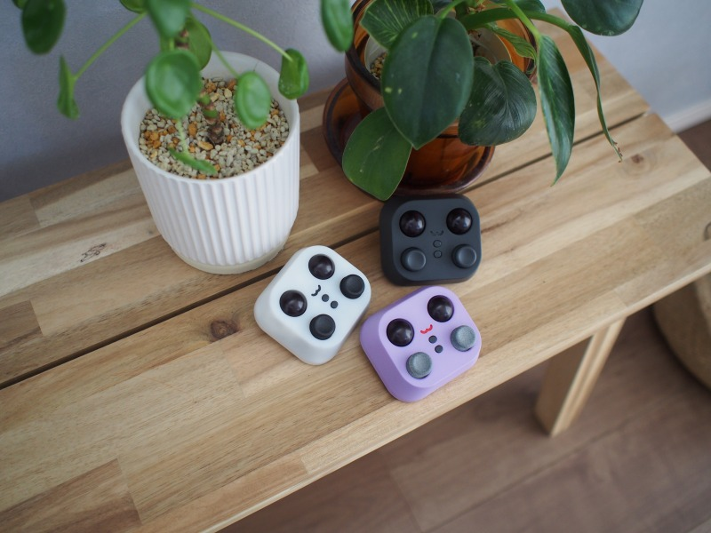
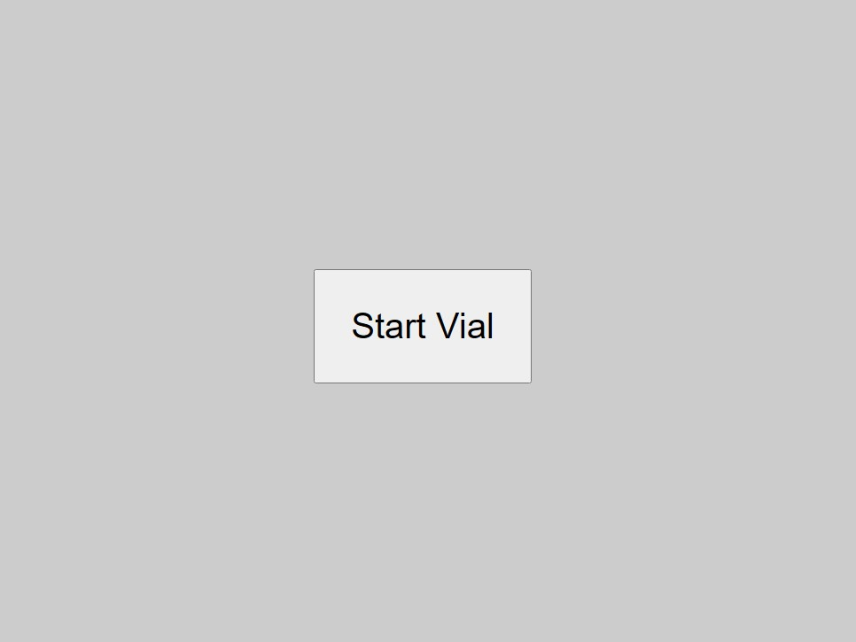
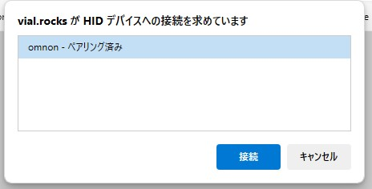
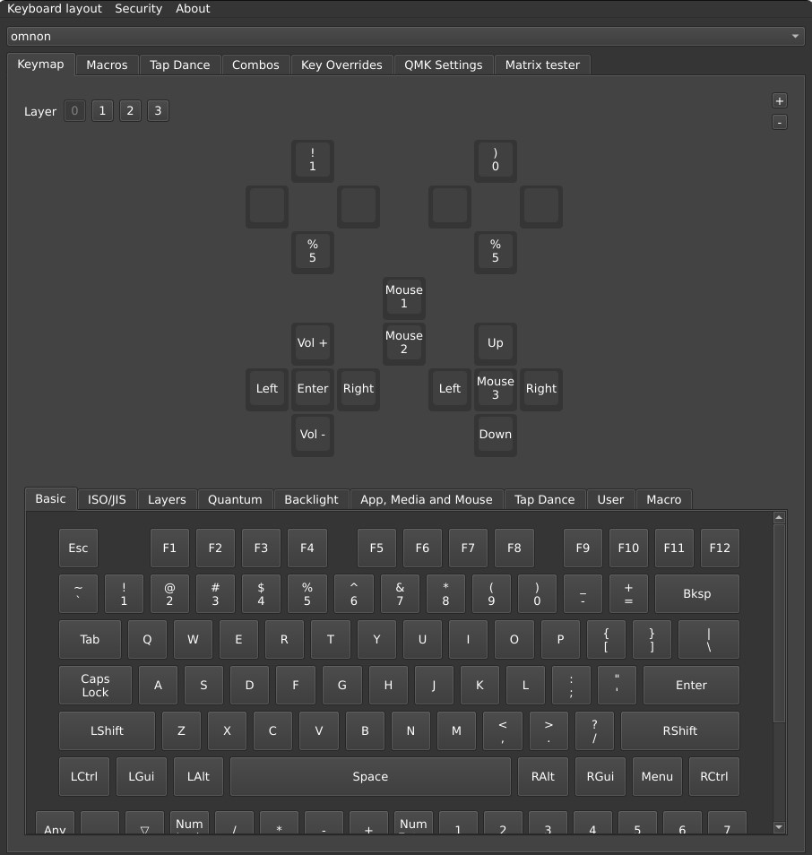
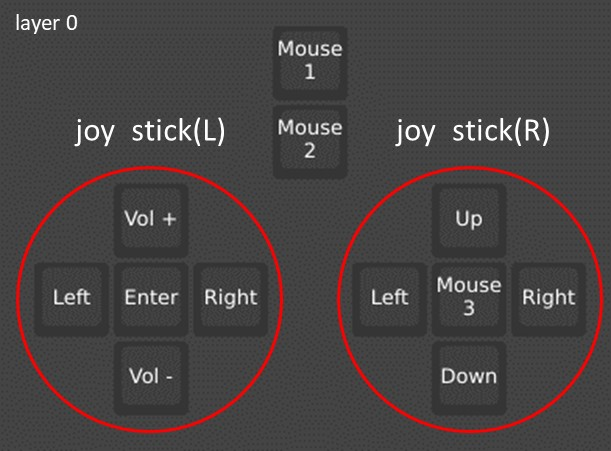
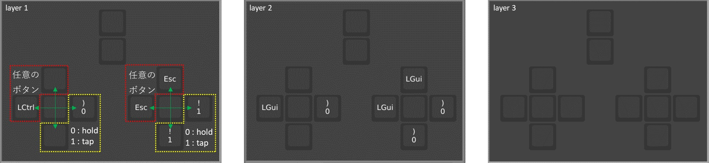
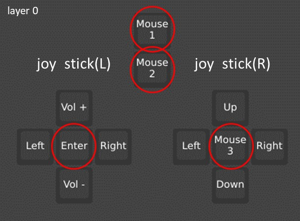

# omnon

Omnon は「トラックボール」と「ジョイスティック」を組み合わせた自作の入力デバイスです。  
デュアルトラックボールの自作キーボードロゴを考えていたときに偶然生まれた、  
可愛さと遊び心を取り入れたシンプルなデバイスです。

## 特徴

- **多様な入力に対応**：ジョイスティックやトラックボール(OP)を操作することで、色々な操作を行うことが出来ます。
- **ジョイスティックの Vial 対応**：ボタンやジョイスティックのカスタマイズをプログラムを書かずに GUI で行えます。

---

- [omnon](#omnon)
  - [特徴](#特徴)
  - [機能の説明と設定](#機能の説明と設定)
    - [Vial](#vial)
    - [ジョイスティックの使い方と設定方法](#ジョイスティックの使い方と設定方法)
    - [各レイヤーの説明](#各レイヤーの説明)
    - [動作例](#動作例)
    - [トラックボールの使い方と設定方法](#トラックボールの使い方と設定方法)
    - [ボタンの設定](#ボタンの設定)
  - [注意点・免責](#注意点免責)

---

## 機能の説明と設定

### Vial

各種設定は[Vial](https://vial.rocks/)により行うことが出来ます。

1. リンクにアクセス後 Start Vial を押下してください。

   

2. omnon への接続を要求されるので接続してください。

   

3. 画面上半分は、omnon の設定状態になります。  
   omnon の変更したい箇所のボタンをクリック後、下半分にある任意のキーを選択することでキーが変更されます。  
   ジョイスティックへの設定を変更するには、USB を再接続(抜き差し)する事で設定が反映されます。

   

> [!CAUTION]
> 通常 Vial ではキー変更のみで反映されます。
> omnon はデバイスの特性上仮想キーを使用しジョイスティックへ割り当てを行っています。
> 変更後は USB を一度差し直すことで、仮想キーの設定がジョイスティックへ反映されます。

### ジョイスティックの使い方と設定方法

---

- ジョイスティックを倒すことでレイヤー 0 に設定されたキーが繰り返し入力されます。
- 倒した角度により、繰り返し入力される頻度が変化します。
- レイヤー 1 ～ 3 の順に設定されたキーが押下(Hold or Tap)された後、レイヤー 0 のキーが Tap されます。

### 各レイヤーの説明

**レイヤー 0**：ジョイスティック操作時に繰り返し入力されるキーを設定します。  
 

**レイヤー 1 ～レイヤー 3**：レイヤー 0 の操作前にホールドまたはタップするキーを設定します。  
 

### 動作例

例：レイヤーの説明画像の場合、下記のように動作します。

- **joy stick(L) 上下 ：** Vol + or Vol -
- **joy stick(L) 左右 ：** LCtrl(Hold) → Lgui(Hold) → Left or Right → Lgui(unHold) → LCtrl(unHold)
  ※仮想デスクトップ切替え
- **joy stick(R) 上下 ：** Esc(Tap) → Lgui(Hold) → UP or Down → Lgui(unHold)
  ※window 移動
- **joy stick(R) 左右 ：** Esc(Tap) → Lgui(Hold) → Left or Right → Lgui(unHold)
  ※window 移動

これにより、簡単にジョイスティック操作を変更し、様々な操作ができます。

---

### トラックボールの使い方と設定方法

トラックボールはマウスの代わりに、ポインタ操作やスクロールを行うことが出来ます。
また、同時に操作することで矢印キーの入力になります。
※この機能はベータ版のため、将来的には削除される可能性があります。

**左トラックボール ：** 上下左右のスクロール操作
**右トラックボール ：** カーソル操作
**同時操作 ：** 上下左右の矢印キー操作

---

### ボタンの設定

赤丸部はレイヤー 0 で任意のボタンを設定することが出来ます。

---

## 注意点・免責

omnon は現在開発中バージョンです。
仕様は、予告なく変更される可能性があります。  
変更が生じた場合、最新の情報は omnon の github をご確認ください。
