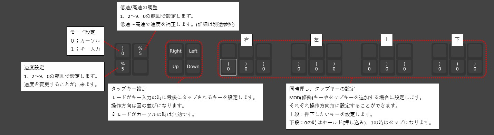

# omnon

omnonはトラックボールとジョイスティックを組み合わせた制作キットです。  
可愛さと遊び心を取り入れた自作入力デバイスです。

---

- [omnon](#omnon)
  - [特徴(機能の説明)](#特徴機能の説明)
    - [カーソル、スクロール、キー入力](#カーソルスクロールキー入力)
    - [mod(修飾)キーとの組み合わせ入力](#mod修飾キーとの組み合わせ入力)
  - [設定](#設定)
    - [Vial接続](#vial接続)
    - [レイヤーの切り替え](#レイヤーの切り替え)
    - [トラックボール/ジョイスティックの感度調整](#トラックボールジョイスティックの感度調整)
  - [使用例](#使用例)
    - [ジョイスティックLRへの割り当て例(レイヤー2)](#ジョイスティックlrへの割り当て例レイヤー2)
    - [トラックボールの同時動作](#トラックボールの同時動作)
  - [注意点・免責](#注意点免責)

---
## 特徴(機能の説明)

omnonの機能について具体的に説明していきます。  
omnonはキーマップの設定を行うことで、ジョイスティックやトラックボールをカスタマイズでき、  
マウス操作、キー入力、mod(修飾)キーとの組み合わせ入力などをすることが出来ます。  

### カーソル、スクロール、キー入力
- カーソル、スクロール、矢印キーを設定した場合

### mod(修飾)キーとの組み合わせ入力
- shiftキー、ctrlキーなどを組み合わせて入力する場合

---
## 設定

### Vial接続

各種設定は [Vial](https://vial.rocks/) により行うことが出来ます。

1. リンクにアクセス後 Start Vial を押下してください。

   

2. omnon への接続を要求されるので接続を押下してください。

   

3. Vial上で設定できるキーの一覧です。
   次から詳細を説明していきます。
   
    

4. ボタン、ジョイスティック(押し込み)の割り当て。
   通常のキースイッチと同じように割り当てが出来ます。
   
   
   

5. ジョイスティック、トラックボールの割り当て。
   カーソル、キー入力、パラメータの調整等を個々に設定できます。
   ※中間段(黄色枠内)はトラックボールを同時に動作した時の動作になります。
   
   

6. ジョイスティック、トラックボールのカスタマイズ。
   上の対応表を参考に、それぞれ個別に下図の設定が出来ます。
   大まかには、マウス/キー入力切り替え、パラメータの調整、操作方向に同時押しするキーの設定などが可能です。
   各種設定は0～2(3個)のレイヤー設定ができます。
   
   
   
   > [!CAUTION]
   >  ジョイスティックやトラックボールにマクロやタップダンスは割り当てられません。
   

### レイヤーの切り替え
1. ボタン1を押しながら、その他のボタンを押すことでレイヤー0~2を切り替えることが出来ます。
   - ボタン2：レイヤー0
   - ボタン3：レイヤー1
   - ボタン4：レイヤー2

   
   
### トラックボール/ジョイスティックの感度調整

  
1. 赤枠内左下のキーで速度を調整します。
2. 赤枠内右上のキーで低速/高速の補正具合を調整します。
      

   設定値を変更すると下図のようなイメージで補正がかかります。
      

   - 5：青色(補正無し)
   - 6～0：橙色(低速側をより減速する)
   - 1～4：灰色(低速側を速くする)
  
※ジョイスティックのキー入力モードは挙動が異なり、右上の値を変更することで1回目の入力時間が変化します。
ジョイスティックで1タップのつもりが連続になってしまう場合は、値を大きくしてください。

1. 動作がちょうどよくなるまで1、2を繰り返します。

---

## 使用例

### ジョイスティックLRへの割り当て例(レイヤー2)
図のように設定すると「ボリューム操作」「仮想デスクトップ切替え」「window移動」が出来ます。
       

- **ジョイスティック(L) 上下 ：** ボリューム操作 Vol + or Vol -
- **ジョイスティック(L) 左右 ：** 仮想デスクトップ切替え ctrl(Hold) → gui(Hold) → 矢印 → 解放処理 
- **ジョイスティック(R) 上下左右 ：** window移動 Esc(Tap) → gui(Hold) → 矢印 → 開放処理

### トラックボールの同時動作

トラックボールは同時に動かすことで、個別で動かしたときと別の動作をすることが出来ます。
例えが、左：カーソル、右：スクロール、同時：矢印キーなどが可能です。
同時動作時は、人差し指と中指で左右のボールを触り、手全体を動かすような感じで操作すると誤動作しにくいです。

> [!CAUTION]
> マウスセンサーを二つ付いている前提となる機能です。  
> マウスセンサーがついていない所は、blank(空白)を設定してください。
> blankにしていない場合、動作に影響がでる場合があります。
 
---

## 注意点・免責

omnonは現在開発中バージョンです。  
仕様は、予告なく変更される可能性があります。  
変更が生じた場合、最新の情報はomnonのgithubをご確認ください。
